# Morse Code Translator
## A functional english to morse code translator written in C++ using the Arduino Framework
 \
This is my arduino code that Takes Serial input from a computers keyboard, and transmits it as morse code on an led connected to an arduino board

## Project Status
- Working State but unfinished

## Architecture
### State Machine


## Build & Test

### Prerequisites
- [PlatformIO Core](https://platformio.org/install/cli) (CLI) or the PlatformIO VS Code extension
    - **Github CI and native tests will not work with only PlatformIo Core**
- An Arduino Uno R3
- External LED (optional)
- External Button (optional)

### Compile and flash the code
```bash
pio run -e uno -t upload
```

### Run tests
```bash
pio test -e native
```
- Runs the unit suite on your machine — no board required.

```bash
pio test -e native
```
- Runs the unite suite through the arduino board

## Usage
1. Open the serial monitor: `pio device monitor`
2. Type a message and press Enter (or press the transmit button).
3. The message encodes to Morse and blinks on the onboard LED.

```bash
 *  Executing task: platformio device monitor 

--- Terminal on /dev/cu.usbmodem11401 | 9600 8-N-1
--- Available filters and text transformations: debug, default, direct, hexlify, log2file, nocontrol, printable, send_on_enter, time
--- More details at https://bit.ly/pio-monitor-filters
--- Quit: Ctrl+C | Menu: Ctrl+T | Help: Ctrl+T followed by Ctrl+H
Translator Initialized
Enter Message: Hello World
Transmitting: Hello World
Enter Message: 
```

Supported characters: A–Z, space, and `! , . ?`